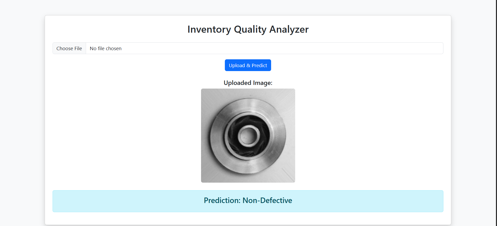

# Inventory Quality Analysis


## Overview
This project implements a Deep Learning-based Inventory Quality Analysis system using a Convolutional Neural Network (CNN). The model classifies product images into two categories:
* Defective
* Non-Defective

The solution includes:
* Image data preprocessing and augmentation
* CNN model building and training using TensorFlow/Keras
* Model evaluation and visualization
* Web deployment using Flask and Bootstrap

## Dataset
The dataset is organized into directory structure format: [Data Link](https://www.kaggle.com/code/dhanyabahadur/product-classification)

```
data/
├── train/
│   ├── defective/
│   └── non_defective/
│
├── test/
│   ├── defective/
│   └── non_defective/
```

## Project Structure

```
Inventory_Quality_Analysis/
│
├── app.py                              # Flask web application
├── notebook.ipynb                      # Model training notebook
├── Inventory_Quality_Analysis.h5       # Trained CNN model
├── train/                              # Trained Dataset
├── test/                               # Test Dataset
├── templates/
│   └── index.html                      # Frontend UI (Bootstrap)
├── static/
│   └── uploads/                        # Uploaded images
├── deployment.png                      # App preview
├── requirements.txt                    # Dependencies
└── README.md
```

## Deep Learning Pipeline

### 1. Data Preprocessing
* Image resizing to 224x224
* Pixel normalization (rescale = 1./255)
* Data augmentation:
  * Rotation
  * Zoom
  * Horizontal flip

### 2. Model Architecture (CNN)
* Conv2D (32 filters) + MaxPooling
* Conv2D (64 filters) + MaxPooling
* Conv2D (128 filters) + MaxPooling
* Flatten layer
* Dense (128 units, ReLU)
* Dropout (0.5)
* Output layer (Sigmoid for binary classification)

### 3. Training
* Loss Function: Binary Crossentropy
* Optimizer: Adam
* Metrics: Accuracy
* Epochs: 10

### 4. Evaluation
Model performance is visualized using:

* Accuracy vs Validation Accuracy
* Loss vs Validation Loss

### 5. Model Saving
The trained model is saved as Inventory_Quality_Analysis.h5

## Web Application Features
* Image upload interface
* Real-time prediction
* Displays uploaded image
* Shows prediction result (Defective / Non-Defective)

## Installation
```
git clone https://github.com/your-username/Inventory_Quality_Analysis.git
cd Inventory_Quality_Analysis
pip install -r requirements.txt
python app.py
```

## Deployment
The application can be deployed on:
* Render
* Railway
* AWS EC2
* Heroku

## Key Learnings
* Building CNN models for image classification
* Data augmentation techniques
* Model evaluation and visualization
* Saving and loading deep learning models
* Deploying ML models using Flask

## Future Improvements
* Multi-class classification support
* Confidence score display
* API integration
* Model optimization (Transfer Learning)
* Improved UI/UX

## Author
Ujjwal Kumar
GitHub: [https://github.com/ujjwalkumar14b](https://github.com/ujjwalkumar14b)

## License
This project is open-source and available under the MIT License.
